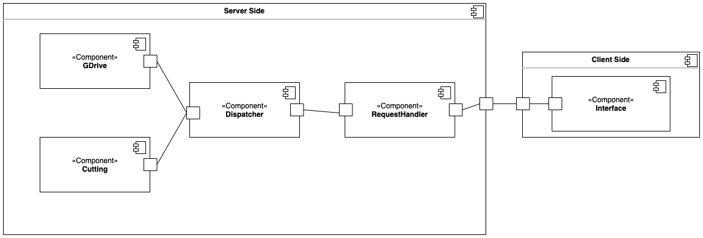
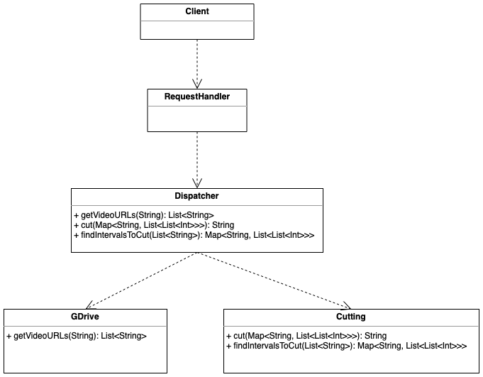

# Zoom2
## Разработчики
- Широков Кирилл
- Шелухина Екатерина

## Общие сведения о системе
### Границы системы
### Контекст системы

## Ключевые требования
### Технические ограничения
### Бизнес-ограничения
### Качественные характеристики системы
### Функциональные требования

## Композиция

Всё приложение разделено на **Server Side** и **Client Side**. Это необходимо для выделения пользовательского API взаимодействия с основным логическим блоком приложения, расположенным на **Server Side**.

Немного о каждой компоненте:
 - **Interface** - единственный компонент клиентской стороны, отвечающий за отображение текущего состояния приложения пользователю, а также являющийся способом взаимодействия пользователя и приложения
 - **RequestHandler** - компонент, отвечающая за приём информации от клиента. В дальнейшем может быть использован для аутентификации и авторизации пользователей
 - **Dispatcher** - внутренний компонент системы. Используется для распределения запросов пользователя по сервисам, а также координации их работы для формирования ответа
 - **GDrive** - является одним из двух основных логических компонентов системы. Он обеспечивает приложение необходимой информацией, получаемой от Google Drive (именно оттуда планируется брать видео для обработки).
 - **Cutting** - второй логический компонент системы. Он производит всю работу по обработке видео (первичная разметка, обрезка и выгрузка на данный момент). Точное назначение компонента может изменится по необходимости во время разработки проекта

## Логическая структура

- `Client` - класс, который отвечает за клиентский интерфейс
- `RequestHandler` - класс, отвечающий за обработку запросов
- `Dispatcher` - класс, отвечающий за работу компонент внутри сервера, выполняет команды, соответствующие запросам пользователя
- `GDrive` - класс, для работы с google диском
- `Cutting` - класс, который занимается поиском интервалов для обрезки видео, а также самой обрезкой (Функциональность может измениться в процессе разработки)

